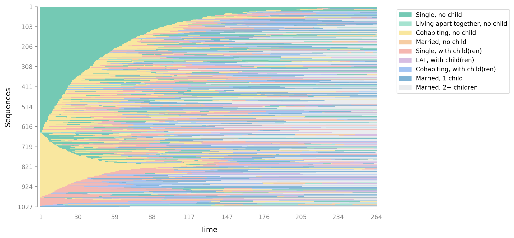
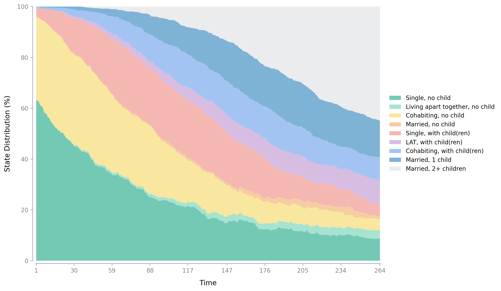
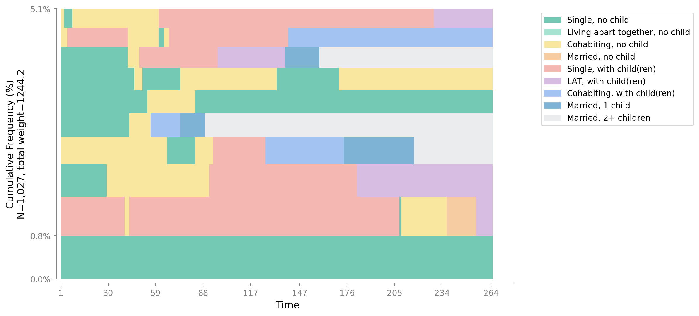
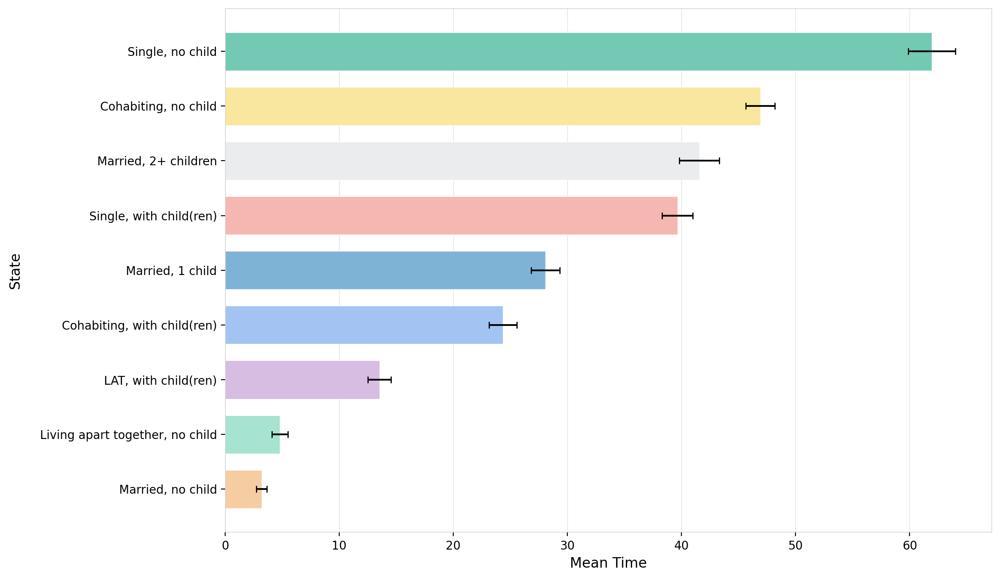
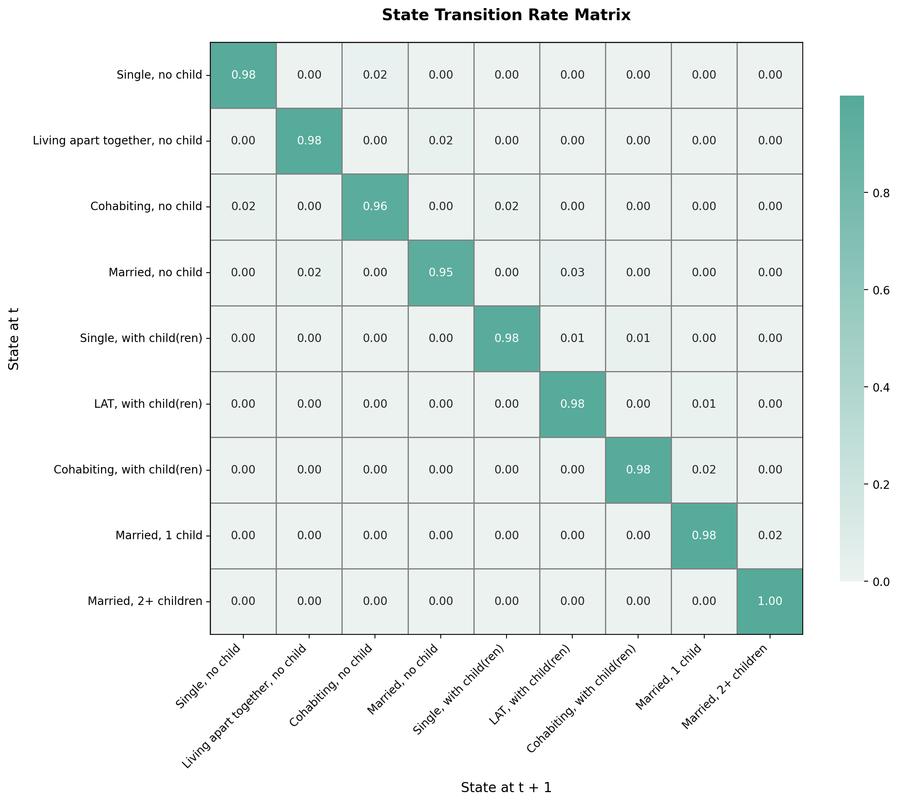
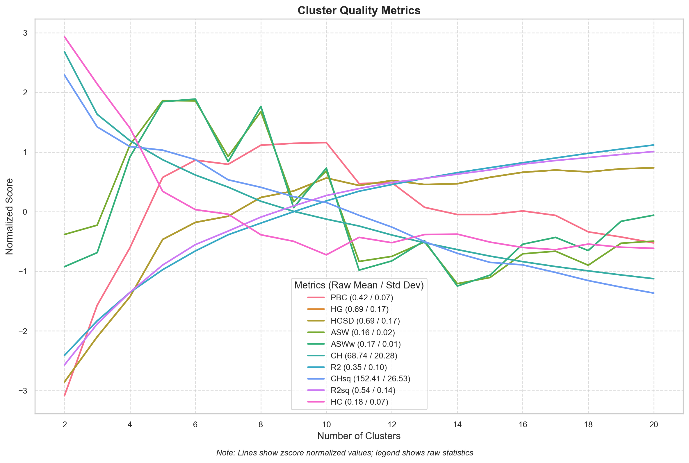
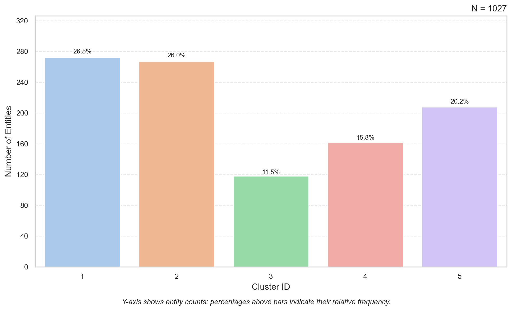
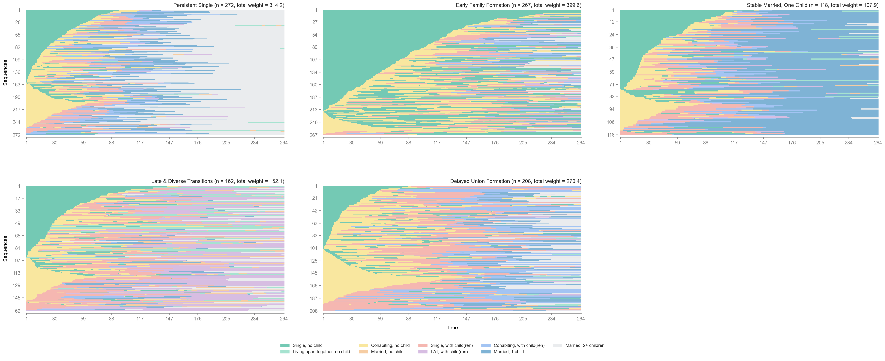
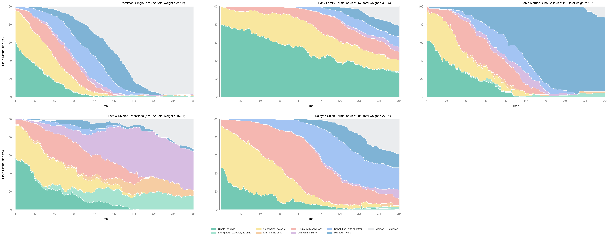

```{r setup, include=FALSE}
knitr::opts_chunk$set(comment = "#>", fig.align = "center")
```

[Yuqi Liang](https://www.yuqi-liang.tech/) and her team developed [`Sequenzo`](https://sequenzo.yuqi-liang.tech/en/), a package for social sequence analysis. Beyond making sequence analysis more accessible to Python users, this package offers significant advantages due to Python's powerful computing capabilities: it is considerably faster than available R tools and better suited for larger datasets. Since we are not Python users ourselves, this brief introduction is specifically aimed at R users who want to leverage the power of `Sequenzo` from within R (as part of an R script) using the `{reticulate}` package.

------------------------------------------------------------------------

## Setup

If you have not installed Python and sequenzo yet you have to run the following two `{reticulate}` functions first:

```{r packages}
# use (and install if necessary) pacman package
if (!require("pacman")) install.packages("pacman")
library(pacman)

# load and install (if necessary) required packages
pacman::p_load(
  knitr,      # tables
  reticulate, # R interface to Python
  tictoc,     # for measuring the duration of distance computation
  tidyverse   # universal toolkit for data wrangling and plotting
)
```

```{r python-install, eval=FALSE}
# --- First-time setup (run once in your R console, then comment out) ---
# install_python()
# py_install("sequenzo", pip = TRUE)
```

Now you are ready to import the data for the example application and `sequenzo`.

```{r import-sequenzo}
library(reticulate)
# --- Import Python modules (no configuration needed) ---
sequenzo <- import("sequenzo")
plt      <- import("matplotlib.pyplot")
```

------------------------------------------------------------------------

## Preparing the data

The imported data frame `family` contains sequence data from 1,866 respondents of the German Family Panel (pairfam). The 264 sequence variables provide monthly information on family biographies -- a combination of partnership status and parity -- from age 18 to 40.

| \#  | State                           | Short Label |
|-----|---------------------------------|-------------|
| 1   | Single, no child                | S           |
| 2   | Living apart together, no child | LAT         |
| 3   | Cohabiting, no child            | COH         |
| 4   | Married, no child               | MAR         |
| 5   | Single, with child(ren)         | Sc          |
| 6   | LAT, with child(ren)            | LATc        |
| 7   | Cohabiting, with child(ren)     | COHc        |
| 8   | Married, 1 child                | MARc1       |
| 9   | Married, 2+ children            | MARc2+      |

### Load the data

```{r load-data}
# Load the pairfam_family dataset bundled with sequenzo
df_py  <- sequenzo$load_dataset("pairfam_family_by_month")
family <- py_to_r(df_py)

cat("Dimensions:", nrow(family), "rows x", ncol(family), "columns\n")
head(family[, 1:8])
```

### Define sequence data with `sequenzo`

```{r define-seqdata}
seqdata <- family |>
  mutate(across(everything(), as.character))

df_py_clean <- r_to_py(seqdata)

# Define time span: 264 months (e.g., 1 ... 264)
time_list <- as.list(as.character(1:264))

# Define 9 states (numeric codes 1–9)
states    <- as.list(as.character(1:9))

# Define labels for each state
labels <- as.list(c(
  "Single, no child",
  "Living apart together, no child",
  "Cohabiting, no child",
  "Married, no child",
  "Single, with child(ren)",
  "LAT, with child(ren)",
  "Cohabiting, with child(ren)",
  "Married, 1 child",
  "Married, 2+ children"
))

colors <- as.list(c(
  "#74C9B4", "#A6E3D0", "#F9E79F", "#F6CDA3",
  "#F5B7B1", "#D7BDE2", "#A3C4F3", "#7FB3D5", "#EAECEE"
))

# Initialize SequenceData object
dataset <- sequenzo$SequenceData(
  df_py_clean,
  time          = time_list,
  id_col        = "id",
  states        = states,
  labels        = labels,
  weights       = r_to_py(as.numeric(family$weight40)),
  custom_colors = colors
)
```

------------------------------------------------------------------------

## Visualise the data

### Legend

```{r plot-legend, results='hide', fig.show='hide'}
dataset$plot_legend(save_as = "legend")
```

### Index plot -- all sequences

```{r index-all, include=FALSE}
sequenzo$plot_sequence_index(dataset, save_as = "index_all")
```



### State-distribution plot -- all sequences

```{r state-dist-all, include=FALSE}
sequenzo$plot_state_distribution(dataset, save_as = "state_dist_all")
```



### Modal plot -- all sequences

```{r modal-state-all,include=FALSE}
sequenzo$plot_modal_state(dataset, save_as = "modal_state")
```


### Most frequent sequences

```{r freq-sequences,include=FALSE}
sequenzo$plot_most_frequent_sequences(dataset, top_n = 10L, save_as = "freq_seq")
```



### Mean time in each state

```{r mean-time,include=FALSE}
sequenzo$plot_mean_time(dataset, save_as = "mean_time")
```



### Transition matrix

```{r transition-matrix,include=FALSE}
sequenzo$plot_transition_matrix(dataset, save_as = "transition")
```



------------------------------------------------------------------------

## Compute dissimilarities

Now we compute the dissimilarity matrix using Optimal Matching with transition-rate substitution costs (`TRATE`) and automatically derived indel costs -- the same configuration used in the original `quickstart.ipynb`.

```{r om-compute}
#| cache: true

tic("sequenzo -- OM (TRATE, indel = auto)")

om <- sequenzo$get_distance_matrix(
  seqdata = dataset,
  method  = "OM",
  sm      = "TRATE",
  indel   = "auto"
)

toc()
```

```{r om-inspect}
# Convert to R matrix for inspection
om_r <- py_to_r(om)
cat("Distance matrix dimensions:", dim(om_r), "\n")
cat("\nFirst 5 x 5 block:\n")
print(round(om_r[1:5, 1:5], 1))
```

### Relative frequency plot

```{r rel-freq,include=FALSE}
sequenzo$plot_relative_frequency(
  seqdata         = dataset,
  distance_matrix = om,
  num_groups      = 12L,
  save_as         = "rel_freq"
)
```


------------------------------------------------------------------------

## Cluster Analysis

### Ward hierarchical clustering

```{r cluster,include=FALSE}
cluster <- sequenzo$Cluster(
  om,
  dataset$ids,
  clustering_method = "ward_d"
)

cluster$plot_dendrogram(
  xlabel  = "Respondents",
  ylabel  = "Distance",
  save_as = "dendrogram"
)
```


### Cluster quality -- selecting *k*

We evaluate clustering solutions and use the **Average Silhouette Width (ASW)** as our primary criterion:

| ASW          | Interpretation       |
|--------------|----------------------|
| \>= 0.50     | Strong structure     |
| 0.25 -- 0.49 | Reasonable structure |
| \< 0.25      | Weak structure       |

```{r cluster-quality}
cq <- sequenzo$ClusterQuality(cluster)
cq$compute_cluster_quality_scores()
```

```{r plot-quality,include=FALSE}
cq$plot_cqi_scores(norm = "zscore", save_as = "cqi_scores")
```



```{r quality-table}
cqi_table <- py_to_r(cq$get_cqi_table())
knitr::kable(cqi_table, caption = "Cluster Quality Indices")
```

::: callout-note
## Choosing *k*

Based on the ASW profile above, **k = 5** is selected: it corresponds to the peak of the ASW curve and yields a substantively interpretable typology of family-life-course trajectories. Adjust `n_clusters` below if your data suggest a different optimum.
:::

```{r set-k}
n_clusters <- 5L
```

### Cluster memberships and distribution

```{r cluster-results}
cr <- sequenzo$ClusterResults(cluster)

# Get membership table (Python DataFrame)
membership_py <- cr$get_cluster_memberships(num_clusters = n_clusters)

# Get distribution
distribution_py <- cr$get_cluster_distribution(num_clusters = n_clusters)
knitr::kable(
  py_to_r(distribution_py),
  caption = sprintf("Cluster distribution -- k = %d", n_clusters)
)
```

```{r plot-distribution,include=FALSE}
cr$plot_cluster_distribution(num_clusters = n_clusters, title = NULL, save_as = "cluster_dist")
```



### Cluster labels

After inspecting the index plots in the next section, we assign descriptive names that reflect the dominant family-state trajectory within each cluster.

```{r cluster-labels}
# Pass membership_py to Python namespace as 'membership_table'
py$membership_table <- membership_py

py_run_string("
membership_table['Cluster'] = membership_table['Cluster'].astype(int)

cluster_labels = {
    1: 'Persistent Single',
    2: 'Early Family Formation',
    3: 'Stable Married, One Child',
    4: 'Late & Diverse Transitions',
    5: 'Delayed Union Formation'
}
")

cluster_labels_py <- py$cluster_labels

# R named vector (for downstream R operations)
cluster_labels_r <- c(
  "1" = "Persistent Single",
  "2" = "Early Family Formation",
  "3" = "Stable Married, One Child",
  "4" = "Late & Diverse Transitions",
  "5" = "Delayed Union Formation"
)
```

| Cluster | Label | Dominant trajectory |
|---------|-------|---------------------|
| 1 (n=272) | **Persistent Single** | Remains single with no child throughout; minimal transitions, occasional late move to cohabitation |
| 2 (n=267) | **Early Family Formation** | Rapid transition from single to cohabiting/married with children; family formation largely complete by age 24 |
| 3 (n=118) | **Stable Married, One Child** | Dominantly married with 1 child from mid-20s onward; stable and relatively early conventional trajectory |
| 4 (n=162) | **Late & Diverse Transitions** | Long spell of singlehood or cohabitation; highly diverse trajectories with late and varied union/fertility outcomes |
| 5 (n=208) | **Delayed Union Formation** | Prolonged single phase; slow transition toward union formation, mostly childless or 1 child by age 40 |

------------------------------------------------------------------------

## Results

### Index plots by cluster

```{r index-clusters,include=FALSE}
py_run_string("
from sequenzo import plot_sequence_index
plot_sequence_index(
    seqdata=r.dataset,
    group_dataframe=membership_table,
    group_column_name='Cluster',
    group_labels=cluster_labels,
    save_as='index_clusters'
)
")
```



### State-distribution plots by cluster

```{r state-dist-clusters,include=FALSE}
py_run_string("
from sequenzo import plot_state_distribution
plot_state_distribution(
    seqdata=r.dataset,
    group_dataframe=membership_table,
    group_column_name='Cluster',
    group_labels=cluster_labels,
    save_as='state_dist_clusters'
)
")
```



------------------------------------------------------------------------

## Prepare for regression

Merge cluster assignments back into the original dataset for downstream analysis (e.g. multinomial logit with `sex`, `highschool`, `migstatus`).

```{r merge-clusters}
# Convert membership table to R
membership_r <- py_to_r(membership_py) |>
  rename(id = `Entity ID`) |>
  mutate(id = as.numeric(id))

# Merge with original data
family_with_clusters <- left_join(family, membership_r, by = "id") |>
  mutate(Cluster_labels = cluster_labels_r[as.character(Cluster)])

family_with_clusters |>
  select(id, weight40, sex, Cluster, Cluster_labels) |>
  head(10) |>
  knitr::kable(caption = "First 10 rows with cluster assignments")
```

```{r export, eval=FALSE}
write.csv(
  select(family_with_clusters, id, weight40, sex, Cluster, Cluster_labels),
  "pairfam_cluster_memberships.csv",
  row.names = FALSE
)
```

------------------------------------------------------------------------

## References {.unnumbered}

Liang, Y. et al. (2025). *Sequenzo: A fast, scalable, and intuitive Python package in social sequence analysis*. <https://sequenzo.yuqi-liang.tech>

Raab, M., & Struffolino, E. (2022). *Sequence Analysis*. SAGE Quantitative Applications in the Social Sciences, 190.
