```{r setup, include=FALSE}
knitr::opts_chunk$set(comment = "#>", fig.align = "center")
dir.create("img", showWarnings = FALSE)  # ensure img/ exists for figure outputs
```

[`Sequenzo`](https://sequenzo.yuqi-liang.tech/en/) is a Python package for social sequence analysis, developed by [Yuqi Liang](https://www.yuqi-liang.tech/) and her team. It is considerably faster than existing tools and better suited for large datasets. We understand that many users in the social sciences may be more familiar with R than Python. The good news is that you can use Sequenzo directly from within R using the `{reticulate}` package.

This tutorial walks you through the full Sequenzo workflow in R, from data preparation to cluster analysis, so you can take advantage of Sequenzo's speed and scalability without leaving your R environment.

We will use the built-in dataset `pairfam_family_by_month`, which contains 264 monthly observations (age 18–40) for 1,027 respondents. The goal is to give a clear, step-by-step introduction that is friendly to R users who are new to Python and to sequence analysis.

-   **What you will learn**
    -   How to set up `{reticulate}` and load `sequenzo` in R
    -   How to load the pairfam family biography dataset from `sequenzo`
    -   How to define a `SequenceData` object for 264-month family sequences (9 family states)
    -   How to visualize family trajectories (index plot, state distribution, modal state, etc.)
    -   How to compute dissimilarities and run a cluster analysis (5 family-trajectory clusters)

The tutorial assumes only basic familiarity with R (data frames, packages) and no prior experience with Python.

::: callout-tip
## How to preview this tutorial in the format of HTML

*Note: It is very important to learn command lines and terminal if you would like to be more technical and understand the underlying mechanics of coding and computer.*

Run Quarto from the folder that contains this file, or pass the full path to the file.

-   **Option A: use command line `cd` (meaning change directory) to the folder first:**\
    `cd path/to/Pairfam_sequenzo`\
    `quarto preview pairfam_sequence_analysis.qmd`\
    (Replace `path/to/Pairfam_sequenzo` with your path, e.g. `Tutorials/R_and_Python/use_Python_in_R/Pairfam_sequenzo` from the project root.)

-   **Option B: use the full path:** `quarto preview /full/path/to/Pairfam_sequenzo/pairfam_sequence_analysis.qmd`

A browser window will open with the rendered HTML. To only build the HTML file without opening a browser, use `quarto render pairfam_sequence_analysis.qmd` (from the same folder or with full path); the output is `pairfam_sequence_analysis.html`.

If you would like to have a PDF version of this tutorial, you can open the HTML file in your Chrome browser, and then save or print it as a PDF.
:::

### When do we use R code, and when do we use Python code?

**Rule of thumb:** This document is an R (Quarto) document. So every code chunk is R code. It means that you are always writing and running R. We never switch to a separate Python script or notebook. When we need Sequenzo (a Python library), we **call it from R** using the **`{reticulate}`** package. So "R vs Python" here really means: "plain R" vs "R code that calls Python."

| What you see in the chunk | What it is | Example |
|----|----|----|
| Normal R syntax | **R code** that runs in R. Load packages, define variables, use R functions. | `library(reticulate)`, `n_clusters <- 5L`, `knitr::include_graphics("img/...")` |
| `something$function_name(...)` where `something` came from Python | **R calling Python**: the object is a Python object living in R; `$` calls its method or attribute. | `sequenzo$load_dataset("...")`, `dataset$plot_legend(save_as = "...")` |
| `import("sequenzo")` | **R code** that loads a Python module and gives you an R reference to it. From then on, `sequenzo$...` is calling Python. | `sequenzo <- import("sequenzo")` |
| `r_to_py(x)` | **R code** that converts an R object `x` into a Python copy, so we can pass it into Python functions. | `df_py_clean <- r_to_py(seqdata)` |
| `py_run_string(" ... ")` | **R code** that runs the **string inside the quotes as Python code**. So the content of the string is the only place where you see real Python syntax (e.g. `from sequenzo import ...`, indentation). | Used later for cluster-by-group plots. |

So: **outside** `py_run_string("...")`, everything is R; **inside** the quotes of `py_run_string("...")`, the text is Python. That way you always know "am I reading R or Python?", and you never leave this R session.

------------------------------------------------------------------------

## Setup

### Install and load R packages

First, make sure you have the necessary R packages. We will use:

-   `{pacman}` for easy package loading/installation
-   `{reticulate}` to call Python from R
-   `{tictoc}` to time the distance computation
-   `{tidyverse}` for basic data wrangling and summaries

```{r packages}
# use (and install if necessary) pacman package
if (!require("pacman")) install.packages("pacman")
library(pacman)

# load and install (if necessary) required packages
pacman::p_load(
  knitr,      # tables
  reticulate, # R interface to Python
  tictoc,     # for measuring the duration of distance computation
  tidyverse   # universal toolkit for data wrangling and plotting
)
```

### One-time Python + Sequenzo installation (if needed)

If you have **never** installed Python or `sequenzo` on this machine, run the following once in your R console (not inside a knitted document), then comment it out:

```{r python-install, eval=FALSE}
# --- First-time setup (run once in your R console, then comment out) ---
# reticulate::install_python()                  # install a Miniconda-based Python
# reticulate::py_install("sequenzo", pip = TRUE) # install the sequenzo package
```

After Python and `sequenzo` are installed, you just need to load them in each new R session.

### Import Python modules

Now we import `sequenzo` from Python. We also import `matplotlib.pyplot` (as `plt`) for optional direct figure inspection.

```{r import-sequenzo}
library(reticulate)

# Import Python modules
sequenzo <- import("sequenzo")
plt      <- import("matplotlib.pyplot", convert = TRUE)
```

If this chunk runs without error, you are ready to work with `Sequenzo` from R.

------------------------------------------------------------------------

## Get a first look at the data

### Available datasets in Sequenzo

`Sequenzo` comes with several example datasets. We will check that `pairfam_family_by_month` is available.

```{r list-datasets}
available <- sequenzo$list_datasets()
available
```

You should see `pairfam_family_by_month` among the dataset names.

### Load the family biography data

Now we load the pairfam data and convert it from a Python DataFrame to an R data frame.

```{r load-data}
# Load dataset from sequenzo (Python)
df_py  <- sequenzo$load_dataset("pairfam_family_by_month")
family <- py_to_r(df_py)

# check size
cat("Dimensions:", nrow(family), "rows x", ncol(family), "columns\n")
# preview first rows and columns
head(family[, 1:8])
```

The dataset has:

-   one row per respondent
-   columns:
    -   `id` (respondent ID)
    -   `weight40` (survey weight)
    -   `sex`, `migstatus`, `highschool`, etc. (background variables)
    -   `1`–`264`: monthly family states over 264 months (age 18–40)

### What do the state codes 1–9 mean?

Each month is coded as one of nine family states combining partnership status and parity:

| \#  | State                           | Short Label |
|-----|---------------------------------|-------------|
| 1   | Single, no child                | S           |
| 2   | Living apart together, no child | LAT         |
| 3   | Cohabiting, no child            | COH         |
| 4   | Married, no child               | MAR         |
| 5   | Single, with child(ren)         | Sc          |
| 6   | LAT, with child(ren)            | LATc        |
| 7   | Cohabiting, with child(ren)     | COHc        |
| 8   | Married, 1 child                | MARc1       |
| 9   | Married, 2+ children            | MARc2+      |

Each row is therefore a sequence of length 264, e.g. `1, 1, 1, ..., 3, 3, 7, 7, 8, 8, 9, 9, ...`

Our goal is to understand **typical family-formation patterns from age 18 to 40**, not just individual biographies.

------------------------------------------------------------------------

## Define sequence data with Sequenzo

`Sequenzo` works with a central object called `SequenceData`. We will now:

1.  Make sure the sequence columns are characters (not factors or numerics).
2.  Tell `Sequenzo` which column is the ID.
3.  Specify the **time points** (1–264) and the **states** (`1`–`9`) with labels and colors.

### Prepare the R data frame

```{r prepare-seqdata}
# Convert all columns to character (required by sequenzo)
seqdata <- family |>
  mutate(across(everything(), as.character))

# Convert to Python DataFrame
df_py_clean <- r_to_py(seqdata)
```

### Create the `SequenceData` object

**What this step does:** We call the Python constructor `sequenzo$SequenceData(...)` from R, passing the DataFrame plus metadata (time indices, state labels, colors). The result `dataset` is a Python object that we keep in R and use later with `dataset$...` for plotting and analysis.

```{r define-seqdata}
# Define time points and states
time_list <- as.list(as.character(1:264))      # months 1–264
states    <- as.list(as.character(1:9))         # 9 family states
labels    <- as.list(c(
  "Single, no child",
  "Living apart together, no child",
  "Cohabiting, no child",
  "Married, no child",
  "Single, with child(ren)",
  "LAT, with child(ren)",
  "Cohabiting, with child(ren)",
  "Married, 1 child",
  "Married, 2+ children"
))

# Colors for the nine states
colors <- as.list(c(
  "#74C9B4", "#A6E3D0", "#F9E79F", "#F6CDA3",
  "#F5B7B1", "#D7BDE2", "#A3C4F3", "#7FB3D5", "#EAECEE"
))

# Initialize the SequenceData object in Python
dataset <- sequenzo$SequenceData(
  df_py_clean,
  time          = time_list,
  id_col        = "id",
  states        = states,
  labels        = labels,
  weights       = r_to_py(as.numeric(family$weight40)),
  custom_colors = colors
)

dataset
```

You should see a short summary confirming `SequenceData` has been created successfully, e.g.:

> Number of sequences: 1027
>
> Number of time points: 264
>
> States: `['1', '2', '3', '4', '5', '6', '7', '8', '9']`

------------------------------------------------------------------------

## Visualise family sequences

Visualization is often the **first and most important step** in sequence analysis. We will create:

-   a legend for the family states
-   an index plot (every individual sequence as a horizontal line)
-   a state-distribution plot (proportions at each time point)
-   a modal-state plot (most frequent state at each time point)
-   most frequent sequences
-   mean time spent in each state
-   a transition matrix

**How plots are shown here:** Each figure is produced by calling a Sequenzo (Python) plotting function with `save_as = "img/..."`, which writes a PNG file into the `img/` folder. We then use `knitr::include_graphics("img/...png")` so that Quarto/knitr reads that file and embeds it in the HTML report. All plots in this section (and the cluster plots later) follow this same pattern.

### Legend

The legend shows the color assigned to each of the 9 family states. It serves as the color key for reading all subsequent plots.

```{r plot-legend}
dataset$plot_legend(save_as = "img/pairfam_legend")
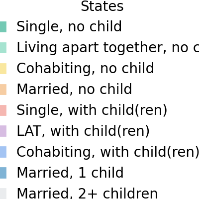
```

### Index plot -- all sequences

The index plot displays every individual sequence as a horizontal line. Each line represents one respondent, and the colors show their family state at each of the 264 months (age 18 to 40). It gives an overview of all trajectories at a glance.

```{r index-all}
sequenzo$plot_sequence_index(dataset, save_as = "img/pairfam_index_all")
knitr::include_graphics("img/pairfam_index_all.png")
```

### State-distribution plot -- all sequences

The state-distribution plot shows, for each month, the **proportion of respondents** in each family state. It gives a quick overview of how family structures evolve with age.

```{r state-dist-all}
sequenzo$plot_state_distribution(dataset, save_as = "img/pairfam_state_dist_all")
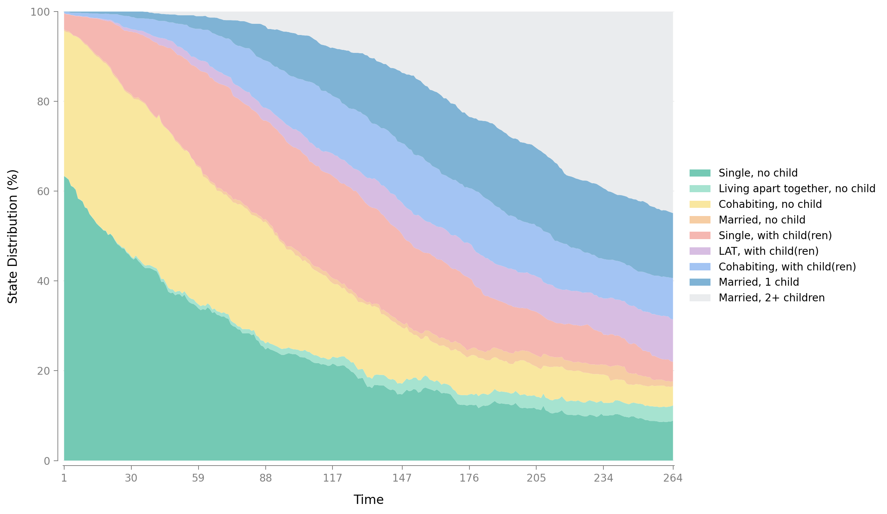
```

### Modal-state plot -- all sequences

The modal-state plot identifies the single most frequent family state at each time point. It highlights the dominant state at each age, making it easy to see broad trends across the life course.

```{r modal-state-all}
sequenzo$plot_modal_state(dataset, save_as = "img/pairfam_modal_state")
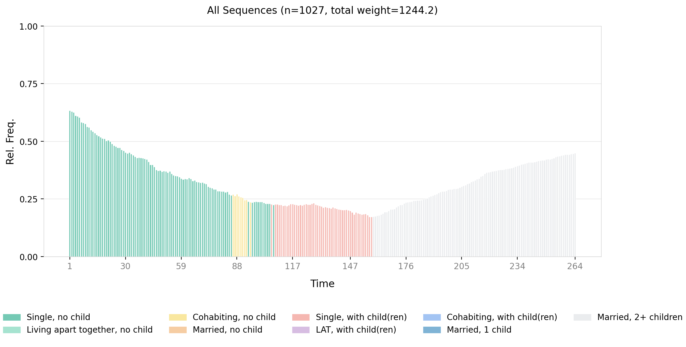
```

### Most frequent sequences

The most-frequent-sequences plot ranks complete 264-month trajectories by how many respondents share the exact same sequence from start to finish. It shows which life-course patterns are most common in the data.

```{r freq-sequences}
sequenzo$plot_most_frequent_sequences(dataset, top_n = 10L, save_as = "img/pairfam_freq_seq")
knitr::include_graphics("img/pairfam_freq_seq.png")
```

### Mean time in each state

The mean-time plot shows the average number of months respondents spend in each family state over the 264-month window. It summarizes how much of the observation period is typically spent in each state.

```{r mean-time}
sequenzo$plot_mean_time(dataset, save_as = "img/pairfam_mean_time")
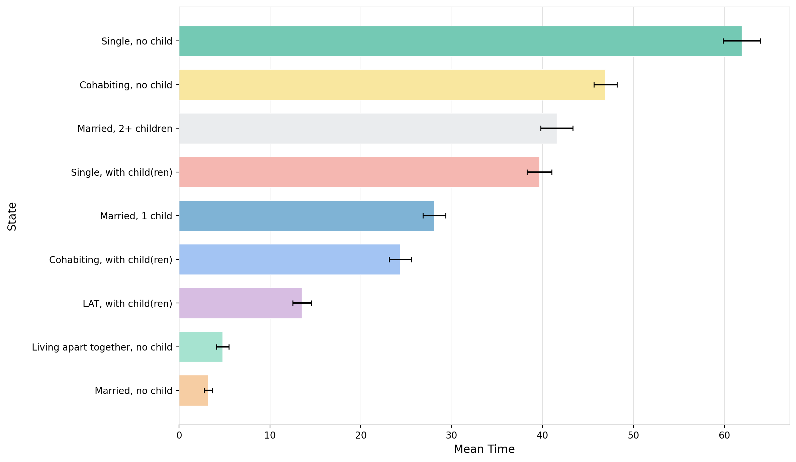
```

### Transition matrix

The transition matrix shows the month-to-month probability of moving from one family state to another. It reveals which transitions are common (e.g. Single to Cohabiting) and which are rare.

```{r transition-matrix}
sequenzo$plot_transition_matrix(dataset, save_as = "img/pairfam_transition")
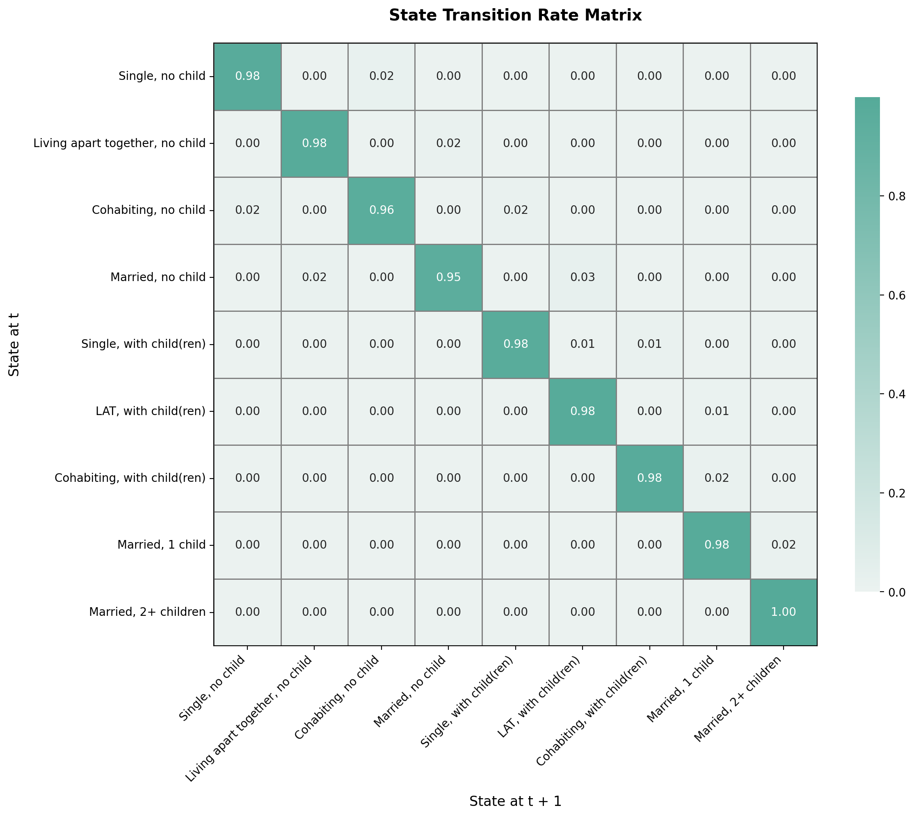
```

------------------------------------------------------------------------

## Compute dissimilarities between sequences

To compare sequences and cluster them, we need a **dissimilarity (distance) matrix**.

Here we use **Optimal Matching (OM)** with transition-rate substitution costs (`TRATE`) and automatically chosen insertion/deletion costs (`indel = "auto"`). This is the same configuration used in other Sequenzo tutorials.

```{r om-compute}
tic("sequenzo -- OM (TRATE, indel = auto)")

om <- sequenzo$get_distance_matrix(
  seqdata = dataset,
  method  = "OM",
  sm      = "TRATE",
  indel   = "auto"
)

toc()
```

Inspect the distance matrix in R:

```{r om-inspect}
om_r <- py_to_r(om)
cat("Distance matrix dimensions:", dim(om_r), "\n")
cat("\nFirst 5 x 5 block:\n")
print(round(om_r[1:5, 1:5], 1))
```

Each entry is the dissimilarity between two respondents' family sequences (larger = more different). You may notice that computing the dissimilarity matrix for 1,027 sequences of length 264 took only few seconds. This is one of the key advantages of Sequenzo: the same computation in R (e.g. using TraMineR) would typically take several minutes. As your dataset grows larger, this speed difference becomes even more significant.

### Relative frequency plot

The relative frequency plot groups similar sequences and displays representative patterns for each group. It reduces visual complexity by showing the most typical trajectories rather than all individual sequences.

```{r rel-freq}
sequenzo$plot_relative_frequency(
  seqdata         = dataset,
  distance_matrix = om,
  num_groups      = 12L,
  save_as         = "img/pairfam_rel_freq"
)
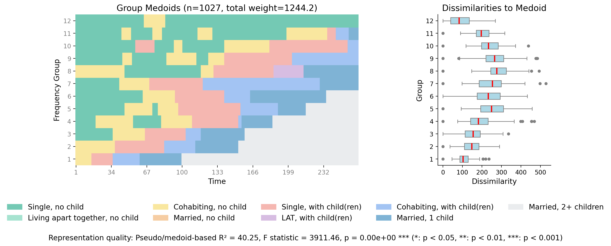
```

------------------------------------------------------------------------

## Cluster analysis

Next, we perform a **cluster analysis** on the dissimilarity matrix. We use:

-   Ward's hierarchical clustering
-   Cluster quality indices (including Average Silhouette Width, ASW)
-   A 5-cluster solution to illustrate distinct family-trajectory groups

### Ward clustering and dendrogram

```{r cluster}
cluster <- sequenzo$Cluster(
  om,
  dataset$ids,
  clustering_method = "ward_d"
)

cluster$plot_dendrogram(
  xlabel  = "Respondents",
  ylabel  = "Distance",
  save_as = "img/pairfam_dendrogram"
)
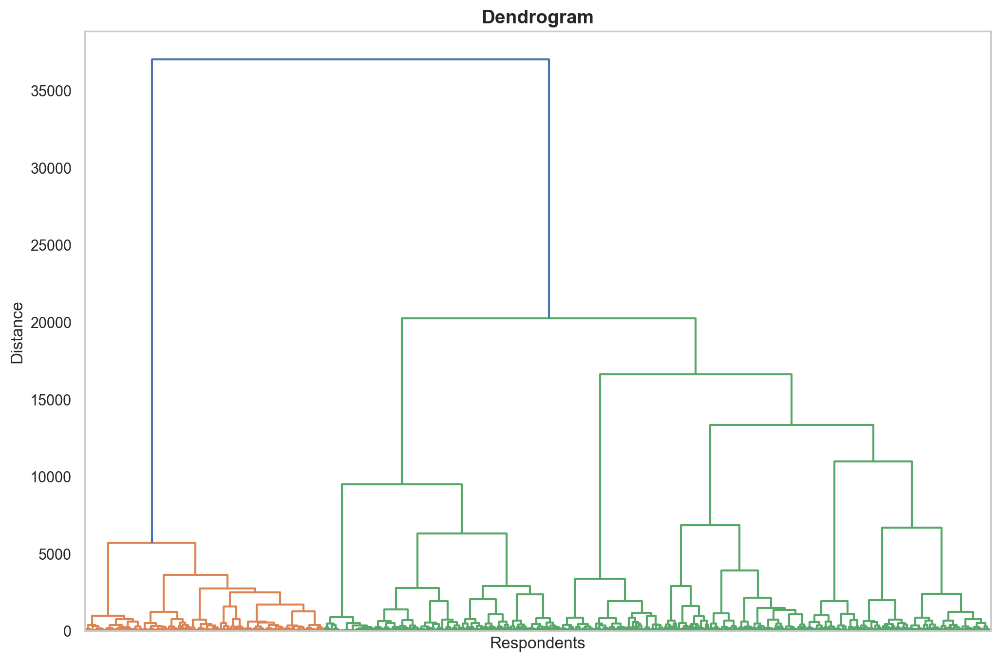
```

### Cluster quality and choosing k

```{r cluster-quality}
cluster_quality <- sequenzo$ClusterQuality(cluster)
cluster_quality$compute_cluster_quality_scores()
```

```{r plot-quality}
cluster_quality$plot_cqi_scores(norm = "zscore", save_as = "img/pairfam_cqi_scores")
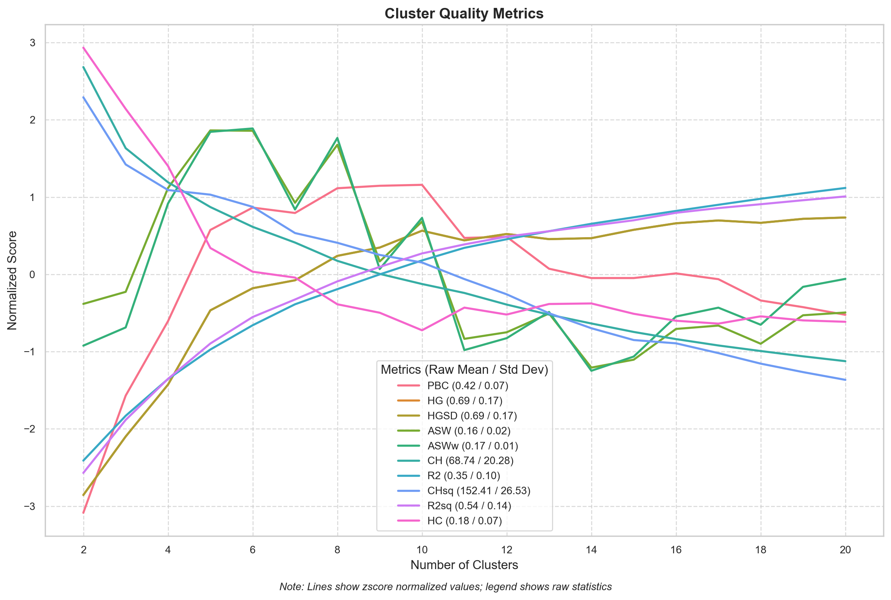
```

```{r quality-table}
cqi_table <- py_to_r(cluster_quality$get_cqi_table())
knitr::kable(cqi_table, caption = "Cluster Quality Indices")
```

We evaluate clustering solutions and use the **Average Silhouette Width (ASW)** as our primary criterion:

| ASW          | Interpretation       |
|--------------|----------------------|
| \>= 0.50     | Strong structure     |
| 0.25 -- 0.49 | Reasonable structure |
| \< 0.25      | Weak structure       |

::: callout-note
## Choosing *k*

Based on the ASW profile above, **k = 5** is selected as the relative optimum. Note that the raw ASW value (≈ 0.16) indicates weak cluster separation, which is common for complex life-course data with high trajectory diversity. The choice of k = 5 is primarily motivated by the local peak of the ASW curve combined with substantive interpretability of the resulting typology.
:::

```{r set-k}
# Number of clusters to use
# 5 gives interpretable family-trajectory groups
n_clusters <- 5L
```

### Cluster memberships and distribution

```{r cluster-results}
cluster_results <- sequenzo$ClusterResults(cluster)

# Membership table (Python DataFrame)
membership_py <- cluster_results$get_cluster_memberships(num_clusters = n_clusters)

# Distribution of cluster sizes
distribution_py <- cluster_results$get_cluster_distribution(num_clusters = n_clusters)
distribution_py
```

```{r plot-distribution}
cluster_results$plot_cluster_distribution(
  num_clusters = n_clusters,
  title        = NULL,
  save_as      = "img/pairfam_cluster_dist"
)
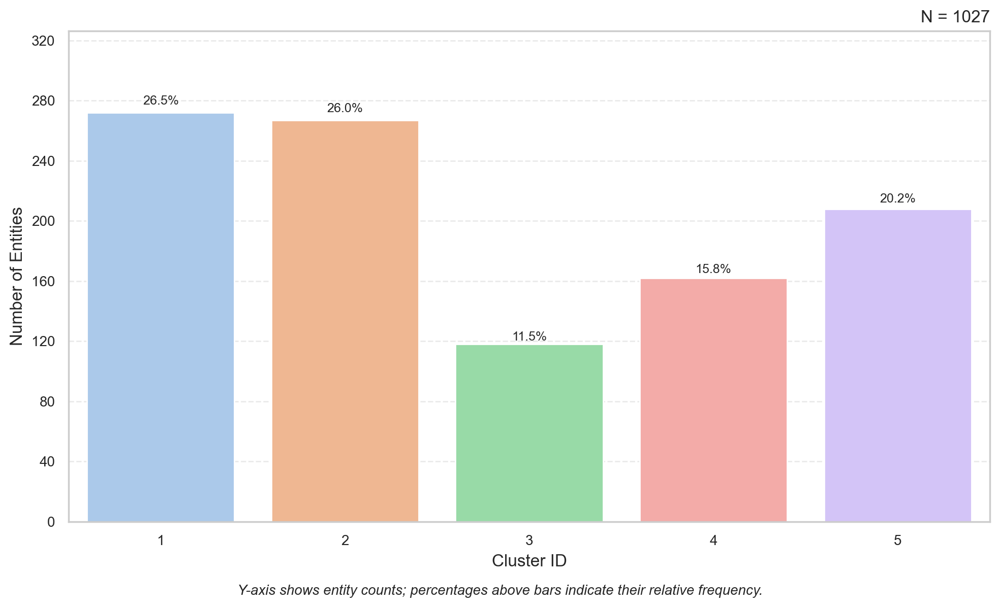
```

------------------------------------------------------------------------

## Interpreting clusters: index and state-distribution plots

To understand what the clusters mean, we look at sequences and state-distribution plots by cluster.

### Prepare cluster labels

We first pass the membership table to the Python namespace and create easily readable labels. These labels are based on inspecting the index and state-distribution plots below.

```{r cluster-labels}
# make membership table available as 'membership_table' in Python
py$membership_table <- membership_py

py_run_string("
membership_table['Cluster'] = membership_table['Cluster'].astype(int)

cluster_labels = {
    1: 'Early Family Formation',  
    2: 'Persistent Single',       
    3: 'Stable Married, One Child',
    4: 'Late & Diverse Transitions',
    5: 'Delayed Union Formation'
}
")

cluster_labels_py <- py$cluster_labels

# R named vector (useful if you later merge back into an R data frame)
cluster_labels_r <- c(
  `1` = "Early Family Formation",  
  `2` = "Persistent Single",       
  `3` = "Stable Married, One Child",
  `4` = "Late & Diverse Transitions",
  `5` = "Delayed Union Formation"
)
```

| Cluster | Label | Dominant trajectory |
|----|----|----|
| 1 (n=272) | **Early Family Formation** | Rapid transition from single to cohabiting/married with children; family formation largely complete by age 24 |
| 2 (n=267) | **Persistent Single** | Remains single with no child throughout; minimal transitions, occasional late move to cohabitation |
| 3 (n=118) | **Stable Married, One Child** | Dominantly married with 1 child from mid-20s onward; stable and relatively early conventional trajectory |
| 4 (n=162) | **Late & Diverse Transitions** | Long spell of singlehood or cohabitation; highly diverse trajectories with late and varied union/fertility outcomes |
| 5 (n=208) | **Delayed Union Formation** | Prolonged single phase; slow transition toward union formation, mostly childless or 1 child by age 40 |

... \### Index plots by cluster

```{r index-clusters}
py_run_string("
from sequenzo import plot_sequence_index

plot_sequence_index(
    seqdata         = r.dataset,
    group_dataframe = membership_table,
    group_column_name = 'Cluster',
    group_labels    = cluster_labels,
    save_as         = 'img/pairfam_index_clusters'
)
")
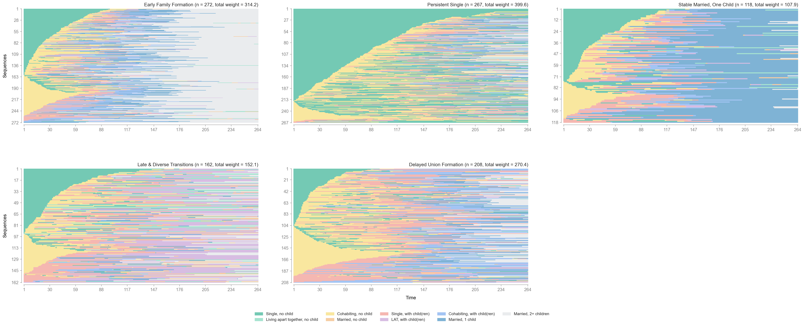
```

Look at how typical family trajectories differ across clusters. For example, Cluster 1 transitions rapidly to blue (Married with children), while Cluster 2 stays mostly green (Single).

### State-distribution plots by cluster

```{r state-dist-clusters}
py_run_string("
from sequenzo import plot_state_distribution

plot_state_distribution(
    seqdata         = r.dataset,
    group_dataframe = membership_table,
    group_column_name = 'Cluster',
    group_labels    = cluster_labels,
    save_as         = 'img/pairfam_state_dist_clusters'
)
")
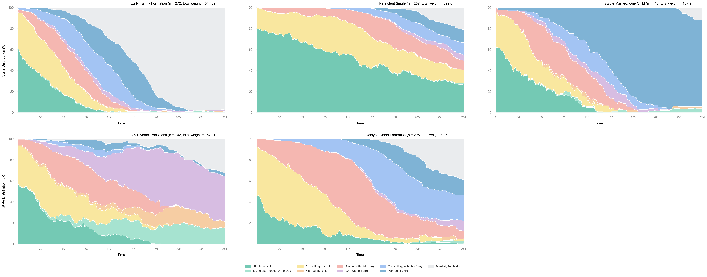
```

These plots show, for each cluster and for each month, the proportion of respondents in each family state. This makes it easier to describe each cluster in words.

------------------------------------------------------------------------

## Prepare for further analysis in R

Often you will want to relate family-trajectory clusters to background variables (e.g. `sex`, `highschool`, `migstatus`) using regression models in **R**.

Here we merge the cluster assignments back into the original R data frame:

```{r merge-clusters}
# Convert membership table to R
membership_r <- py_to_r(membership_py) |>
  rename(id = `Entity ID`) |>
  mutate(id = as.numeric(id))

# Merge with original data
family_with_clusters <- left_join(family, membership_r, by = "id") |>
  mutate(Cluster_labels = cluster_labels_r[as.character(Cluster)])

family_with_clusters |>
  select(id, weight40, sex, Cluster, Cluster_labels) |>
  head(10) |>
  knitr::kable(caption = "First 10 rows with cluster assignments")
```

You can now:

-   run regression models in R (e.g. multinomial logit) with cluster membership as the outcome
-   explore cross-tabulations of cluster by `sex`, `migstatus`, etc.
-   create your own visualizations with `{ggplot2}`

You can also export a small file with IDs and cluster labels:

```{r export, eval=FALSE}
write.csv(
  family_with_clusters |>
    select(id, weight40, sex, Cluster, Cluster_labels),
  "pairfam_cluster_memberships.csv",
  row.names = FALSE
)
```

------------------------------------------------------------------------

## Summary

In this tutorial, you have:

1.  Set up `{reticulate}` and called Python's `sequenzo` package from R.
2.  Loaded the **pairfam_family_by_month** dataset and created a `SequenceData` object for 264-month family biography sequences with 9 states.
3.  Visualized family trajectories using index plots, state-distribution plots, modal-state plots, and more.
4.  Computed sequence dissimilarities with Optimal Matching and ran a cluster analysis.
5.  Interpreted 5 clusters as typical family-trajectory types and merged them back into an R data frame for further analysis.

The same workflow can be adapted to your own sequence data: you just need an ID column, a set of time-ordered state columns, and background variables for later modeling.

------------------------------------------------------------------------

## References {.unnumbered}

Liang, Y. et al. (2025). *Sequenzo: A fast, scalable, and intuitive Python package in social sequence analysis*. <https://sequenzo.yuqi-liang.tech>

Raab, M., & Struffolino, E. (2022). *Sequence Analysis*. SAGE Quantitative Applications in the Social Sciences, 190.
