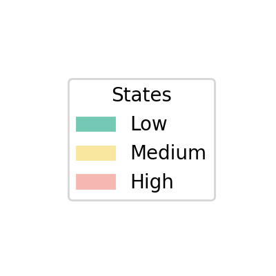
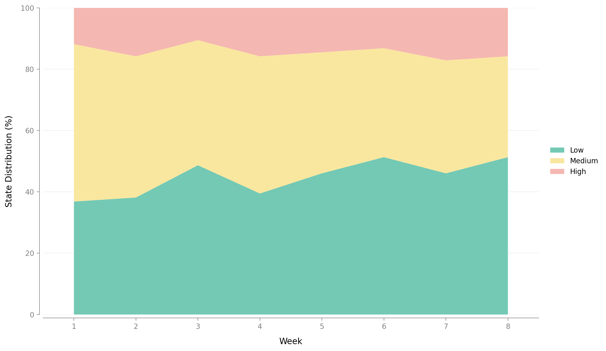
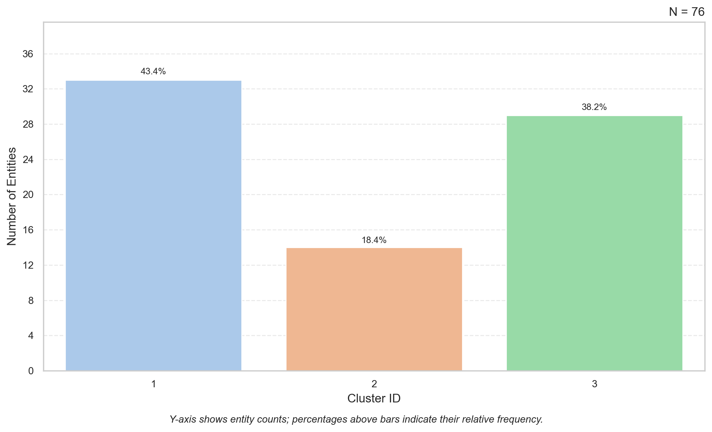

```{r setup, include=FALSE}
knitr::opts_chunk$set(comment = "#>", fig.align = "center")
dir.create("img", showWarnings = FALSE)  # ensure img/ exists for figure outputs
```

This tutorial shows how to use [`Sequenzo`](https://sequenzo.yuqi-liang.tech/en/) from R (via the `{reticulate}` package) to analyze weekly stress sequences from the DEPRESS study (Guo et al., 2026). For further details about the DEPRESS study, please refer to [our documentation](https://sequenzo.yuqi-liang.tech/en/datasets/stress-data).

We will use the built-in dataset `students_stress_states_by_week`, which is the same data used in the Python notebook `stress_typical_workflow.ipynb`. The goal is to give a clear, step-by-step introduction that is friendly to R users who are new to Python and to sequence analysis.

- **What you will learn**
  - How to set up `{reticulate}` and load `sequenzo` in R
  - How to load the stress sequence dataset from `sequenzo`
  - How to define a `SequenceData` object for 8-week stress sequences (Low / Medium / High)
  - How to visualize stress trajectories (index plot, state distribution, etc.)
  - How to compute dissimilarities and run a simple cluster analysis (3 stress-pattern clusters)

The tutorial assumes only basic familiarity with R (data frames, packages) and no prior experience with Python.

::: {.callout-tip}
## How to preview this tutorial in the format of HTML

*Note: It is very important to learn command lines and terminal if you would like to be more technical and understand the underlying mechanics of coding and computer.*

Run Quarto from the folder that contains this file (`R_tutorial`), or pass the full path to the file.

- **Option A: use command line `cd` (meaning change directory) to the folder first:**  
  `cd path/to/R_tutorial`  
  `quarto preview stress_sequence_analysis_R.qmd`  
  (Replace `path/to/R_tutorial` with your path, e.g. `Tutorials/R_and_Python/use_Python_in_R/stress_data/R_tutorial` from the project root.)

- **Option B: use the full path:**  
  `quarto preview /full/path/to/R_tutorial/stress_sequence_analysis_R.qmd`

A browser window will open with the rendered HTML. To only build the HTML file without opening a browser, use `quarto render stress_sequence_analysis_R.qmd` (from the same folder or with full path); the output is `stress_sequence_analysis_R.html`.

If you would like to have a PDF version of this tutorial, you can open the HTML file in your Chrome browser, and then save or print it as a PDF. It is a lot easier than trying to render the PDF directly in Quarto as Quarto uses LaTeX under the hood for PDF generation and you might encounter a lot of errors (LaTeX not found, pdflatex not found, etc.).
:::

### When do we use R code, and when do we use Python code?

**Rule of thumb:** This document is an R (Quarto) document. So every code chunk is R code. It means that you are always writing and running R. We never switch to a separate Python script or notebook. When we need Sequenzo (a Python library), we **call it from R** using the **`{reticulate}`** package. So “R vs Python” here really means: “plain R” vs “R code that calls Python.”

| What you see in the chunk | What it is | Example |
|---------------------------|------------|--------|
| Normal R syntax           | **R code** that runs in R. Load packages, define variables, use R functions. | `library(reticulate)`, `n_clusters <- 3`, `knitr::include_graphics("img/...")` |
| `something$function_name(...)` where `something` came from Python | **R calling Python**: the object is a Python object living in R; `$` calls its method or attribute. | `sequenzo$load_dataset("...")`, `sequence_data$plot_legend(save_as = "...")` |
| `import("sequenzo")`      | **R code** that loads a Python module and gives you an R reference to it. From then on, `sequenzo$...` is calling Python. | `sequenzo <- import("sequenzo")` |
| `r_to_py(x)`              | **R code** that converts an R object `x` into a Python copy, so we can pass it into Python functions. | `stress_py <- r_to_py(stress_seq)` |
| `py_run_string(" ... ")`   | **R code** that runs the **string inside the quotes as Python code**. So the content of the string is the only place where you see real Python syntax (e.g. `from sequenzo import ...`, indentation). | Used later for a few cluster plots. |

So: **outside** `py_run_string("...")`, everything is R; **inside** the quotes of `py_run_string("...")`, the text is Python. That way you always know “am I reading R or Python?”, and you never leave this R session.

------------------------------------------------------------------------

## Setup

### Install and load R packages

First, make sure you have the necessary R packages. We will use:

- `{pacman}` for easy package loading/installation
- `{reticulate}` to call Python from R
- `{tidyverse}` for basic data wrangling and summaries

```{r packages}
# use (and install if necessary) pacman package
if (!require("pacman")) install.packages("pacman")
library(pacman)

# load and install (if necessary) required packages
pacman::p_load(
  knitr,      # tables
  reticulate, # R interface to Python
  tidyverse   # data wrangling and plotting
)
```

### One-time Python + Sequenzo installation (if needed)

If you have **never** installed Python or `sequenzo` on this machine, run the following once in your R console (not inside a knitted document), then comment it out:

```{r python-install, eval=FALSE}
# --- First-time setup (run once in your R console, then comment out) ---
# reticulate::install_python()                  # install a Miniconda-based Python
# reticulate::py_install("sequenzo", pip = TRUE) # install the sequenzo package
```

After Python and `sequenzo` are installed, you just need to load them in each new R session.

### Import Python modules

Now we import `sequenzo` from Python. We will also import `matplotlib.pyplot` (as `plt`) in case you want to inspect the figures directly in Python, but this is optional.

```{r import-sequenzo}
library(reticulate)

# Import Python modules
sequenzo <- import("sequenzo")
plt      <- import("matplotlib.pyplot", convert = TRUE)
```

If this chunk runs without error, you are ready to work with `Sequenzo` from R.

------------------------------------------------------------------------

## Get a first look at the data

### Available datasets in Sequenzo

`Sequenzo` comes with several example datasets. We will check that `students_stress_states_by_week` is available.

```{r list-datasets}
available <- sequenzo$list_datasets()
available
```

You should see `students_stress_states_by_week` among the dataset names.

### Load the stress sequence data

Now we load the stress data and convert it from a Python DataFrame to an R data frame.

```{r load-data}
# Load dataset from sequenzo (Python)
df_py <- sequenzo$load_dataset("students_stress_states_by_week")

# Keep as a Python DataFrame and preview in-place
stress <- df_py
stress$head()
```

The dataset has:

- one row per student
- columns:
  - `participant_id` (ID)
  - `cohort` (Summer / Fall / Spring)
  - `1`–`8`: weekly stress states over 8 weeks
  - background variables such as `gender`, `income_group`, `race`, and `avg_study_time`

### What do L / M / H mean?

In this cleaned dataset, each week is coded as one of three stress states:

- **L** = Low stress
- **M** = Medium stress
- **H** = High stress

Each row is therefore a sequence of length 8, e.g.

- `M, M, M, M, M, L, L, M`
- `L, L, L, L, L, L, M, L`
- `H, H, M, M, M, M, M, M`

Our goal is to understand **typical patterns over 8 weeks**, not just individual scores.

------------------------------------------------------------------------

## Define sequence data with Sequenzo

`Sequenzo` works with a central object called `SequenceData`. We will now:

1. Make sure the weekly columns are characters (not factors or logicals).
2. Tell `Sequenzo` which column is the ID.
3. Specify the **time points** (1–8) and the **states** (`L`, `M`, `H`) with labels and colors.

### Prepare the R data frame

```{r prepare-seqdata}
# For this tutorial we work directly with the Python DataFrame.
# It already stores weekly states as strings ('L', 'M', 'H').
stress_seq <- stress
stress_seq$head()
```

### Send the data to Python and create `SequenceData`

**What this step does:** Sequenzo is a Python library. Its main entry point is a **`SequenceData`** object: a Python object that holds your sequence table plus metadata (time points, state labels, colors). All later steps (plots, distance matrix, clustering) expect this object.

Right now we have the stress data either as an R data frame or already as a Python DataFrame (from `sequenzo$load_dataset()`). To create `SequenceData`, we must call the **Python** constructor and pass it data that Python understands. So we do two things:

1. **Pass data into Python:** If the table is in R, we use **`r_to_py(stress_seq)`** to create a *Python* copy of it (a pandas DataFrame). If we kept the result of `load_dataset()` in R, that is already a Python object; in that case we can pass it directly. Here we use `r_to_py` so that whatever we have is in the right form for Python.
2. **Call the Python constructor:** **`sequenzo$SequenceData(...)`** is the R way of calling Python’s `SequenceData(...)`. We pass that DataFrame plus options (time indices, state names, labels, colors). The result **`sequence_data`** is a Python object that we keep in R and use later with `sequence_data$...` for plotting and analysis.

So “send the data to Python” simply means: make sure Python has the table (via `r_to_py` or by using the DataFrame we already got from `load_dataset`), then call Sequenzo’s constructor so that we get one `SequenceData` object to use everywhere below.

```{r define-seqdata}
# Ensure Python has the table: convert R object to a Python (pandas) DataFrame if needed
stress_py <- r_to_py(stress_seq)

# Define time points and states
time_list <- as.list(as.character(1:8))      # weeks 1–8
states    <- as.list(c("L", "M", "H"))       # Low / Medium / High
labels    <- as.list(c("Low", "Medium", "High"))

# Optional: choose colors for the three states
colors <- as.list(c(
  "#74C9B4",  # Low
  "#F9E79F",  # Medium
  "#F5B7B1"   # High
))

# Initialize the SequenceData object in Python
sequence_data <- sequenzo$SequenceData(
  stress_py,
  time          = time_list,
  id_col        = "participant_id",
  states        = states,
  labels        = labels,
  custom_colors = colors
)

sequence_data
```

You should see a short summary, for example:

> Number of sequences: 76  
> Number of time points: 8  
> States: `['L', 'M', 'H']`

This confirms that `SequenceData` has been created successfully.

------------------------------------------------------------------------

## Visualise stress sequences

Visualization is often the **first and most important step** in sequence analysis. We will create:

- a legend for the stress states
- an index plot
- a state-distribution plot (how common each state is at each week)
- mean time spent in each state

**How plots are shown here:** Each figure is produced by calling a Sequenzo (Python) plotting function with `save_as = "img/..."`, which writes a PNG file into the `img/` folder. We then use `knitr::include_graphics("img/...png")` so that Quarto/knitr reads that file and embeds it in the HTML report. All plots in this section (and the cluster plots later) follow this same pattern—no need to repeat it under each one.

### Legend

```{r plot-legend}
sequence_data$plot_legend(save_as = "img/stress_legend")

```

### Index plot

```{r index-all}
sequenzo$plot_sequence_index(
  seqdata = sequence_data,
  xlabel  = "Week",
  save_as = "img/stress_index_all"
)
knitr::include_graphics("img/stress_index_all.png")
```

Each horizontal line is a student; colors show Low / Medium / High stress for weeks 1–8.

### State-distribution plot

```{r state-dist-all}
sequenzo$plot_state_distribution(
  seqdata = sequence_data,
  xlabel  = "Week",
  save_as = "img/stress_state_dist_all"
)

```

This plot shows, for each week, the **proportion of students** in each stress state. It gives a quick overview: for example, is High stress more common at the beginning or later?

### Mean time in each state

```{r mean-time}
sequenzo$plot_mean_time(
  seqdata = sequence_data,
  save_as = "img/stress_mean_time"
)
knitr::include_graphics("img/stress_mean_time.png")
```

This tells us how many weeks, on average, students spend in each stress level over the 8 weeks.

------------------------------------------------------------------------

## Compute dissimilarities between sequences

To compare sequences and cluster them, we need a **dissimilarity (distance) matrix**.

Here we use **Optimal Matching (OM)** with transition-rate substitution costs (`TRATE`) and automatically chosen insertion/deletion costs (`indel = "auto"`). This is the same configuration used in other Sequenzo tutorials.

```{r om-compute}
#| cache: true
om <- sequenzo$get_distance_matrix(
  seqdata = sequence_data,
  method  = "OM",
  sm      = "TRATE",
  indel   = "auto"
)
```

Inspect the distance matrix in R:

```{r om-inspect}
# `om` is a Python (pandas / NumPy) distance matrix from sequenzo.
# Show a small 5 x 5 block using Python-style indexing for intuition.
om_block <- om$iloc[0:5, 0:5]
om_block
```

Each entry is the dissimilarity between two students’ stress sequences (larger = more different).

------------------------------------------------------------------------

## Cluster analysis

Next, we perform a simple **cluster analysis** on the dissimilarity matrix. We use:

- Ward’s hierarchical clustering
- Cluster quality indices (including Average Silhouette Width, ASW)
- A 3-cluster solution to illustrate distinct stress-pattern groups

### Ward clustering and dendrogram

```{r cluster}
cluster <- sequenzo$Cluster(
  om,
  sequence_data$ids,
  clustering_method = "ward_d"
)

cluster$plot_dendrogram(
  xlabel  = "Students",
  ylabel  = "Distance",
  save_as = "img/stress_dendrogram"
)
knitr::include_graphics("img/stress_dendrogram.png")
```

### Cluster quality and choosing k

```{r cluster-quality}
cluster_quality <- sequenzo$ClusterQuality(cluster)
cluster_quality$compute_cluster_quality_scores()
```

```{r plot-quality}
cluster_quality$plot_cqi_scores(
  norm   = "zscore",
  save_as = "img/stress_cqi_scores"
)
knitr::include_graphics("img/stress_cqi_scores.png")
```

```{r quality-table}
cqi_table <- cluster_quality$get_cqi_table()
cqi_table
```

In this tutorial we focus on a 3-cluster solution (k = 3), which is often a good starting point for summarizing typical stress patterns (e.g. low, moderate, high / fluctuating trajectories).

```{r set-k}
# Number of clusters to use 
# 3 gives interpretable groups, e.g. low / moderate / high stress
n_clusters <- 3
```

### Cluster memberships and distribution

```{r cluster-results}
cluster_results <- sequenzo$ClusterResults(cluster)

# Membership table (Python DataFrame)
membership_py <- cluster_results$get_cluster_memberships(num_clusters = n_clusters)

# Distribution of cluster sizes (printed directly as a pandas DataFrame)
distribution_py <- cluster_results$get_cluster_distribution(num_clusters = n_clusters)
distribution_py
```

```{r plot-distribution}
cluster_results$plot_cluster_distribution(
  num_clusters = n_clusters,
  title        = NULL,
  save_as      = "img/stress_cluster_dist"
)

```

------------------------------------------------------------------------

## Interpreting clusters: index and state-distribution plots

To understand what the clusters mean, we look at sequences and state-distribution plots by cluster.

### Prepare cluster labels 

We first pass the membership table to the Python namespace and create some human-readable labels. Here is an example with three descriptive labels that you can adapt to your own data:

```{r cluster-labels}
# make membership table available as 'membership_table' in Python
py$membership_table <- membership_py

py_run_string("
membership_table['Cluster'] = membership_table['Cluster'].astype(int)

cluster_labels = {
    1: 'Mostly Low Stress',
    2: 'Medium / Fluctuating',
    3: 'Consistently High or Rising'
}
")

cluster_labels_py <- py$cluster_labels

# R named vector (useful if you later merge back into an R data frame)
cluster_labels_r <- c(
  `1` = "Mostly Low Stress",
  `2` = "Medium / Fluctuating",
  `3` = "Consistently High or Rising"
)
```

### Index plots by cluster

```{r index-clusters}
py_run_string("
from sequenzo import plot_sequence_index

plot_sequence_index(
    seqdata         = r.sequence_data,
    group_dataframe = membership_table,
    group_column_name = 'Cluster',
    group_labels    = cluster_labels,
    xlabel          = 'Week',
    save_as         = 'img/stress_index_clusters'
)
")
knitr::include_graphics("img/stress_index_clusters.png")
```

Look at how typical stress trajectories differ across clusters. For example, one cluster may show mostly Low stress, while another shows frequent High stress or increasing stress over time.

### State-distribution plots by cluster

```{r state-dist-clusters}
py_run_string("
from sequenzo import plot_state_distribution

plot_state_distribution(
    seqdata         = r.sequence_data,
    group_dataframe = membership_table,
    group_column_name = 'Cluster',
    group_labels    = cluster_labels,
    xlabel          = 'Week',
    save_as         = 'img/stress_state_dist_clusters'
)
")
knitr::include_graphics("img/stress_state_dist_clusters.png")
```

These plots show, for each cluster and for each week, the proportion of students in Low / Medium / High stress. This makes it easier to describe each cluster in words (for example, “mostly Low stress throughout” vs. “starts Medium and becomes High”).

------------------------------------------------------------------------

## Prepare for further analysis in R

Often you will want to relate stress-pattern clusters to background variables (e.g. `cohort`, `gender`, `income_group`, `avg_study_time`) using regression models in **R**.

Here we merge the cluster assignments back into the original R data frame:

```{r merge-clusters}
# For simplicity (and to avoid R/Python conversion issues), we inspect
# the first rows of the Python membership table directly.
membership_py$head()
```

You can now:

- run regression models in R (e.g. multinomial logit) with cluster membership as the outcome
- explore cross-tabulations of cluster by `cohort`, `gender`, etc.
- create your own visualizations with `{ggplot2}`

You can also export a small file with IDs and cluster labels:

```{r export, eval=FALSE}
write.csv(
  stress_with_clusters |>
    select(participant_id, cohort, gender, income_group, Cluster, Cluster_labels),
  "stress_cluster_memberships.csv",
  row.names = FALSE
)
```

------------------------------------------------------------------------

## Summary

In this tutorial, you have:

1. Set up `{reticulate}` and called Python’s `sequenzo` package from R.
2. Loaded the **students_stress_states_by_week** dataset from DEPRESS and created a `SequenceData` object for 8-week stress sequences.
3. Visualized stress trajectories using index plots and state-distribution plots.
4. Computed sequence dissimilarities with Optimal Matching and ran a simple cluster analysis.
5. Interpreted clusters as typical stress trajectories and merged them back into an R data frame for further analysis.

The same workflow can be adapted to your own sequence data: you just need an ID column, a set of time-ordered state columns, and background variables for later modeling.

