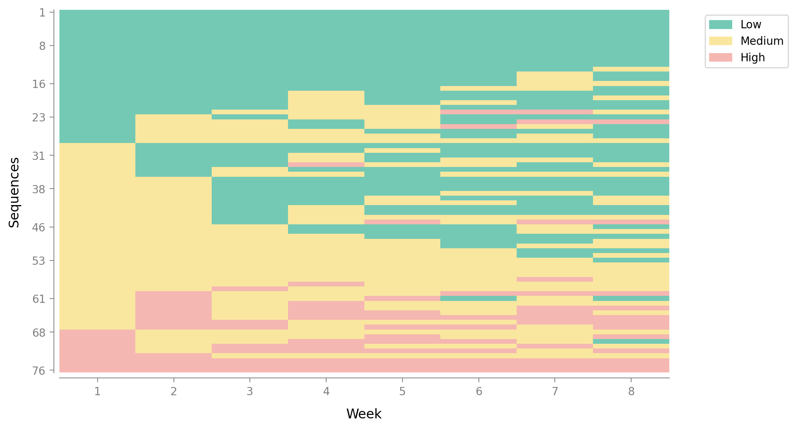
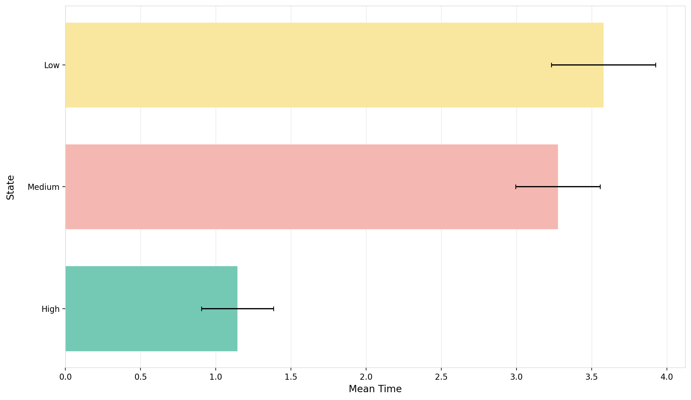
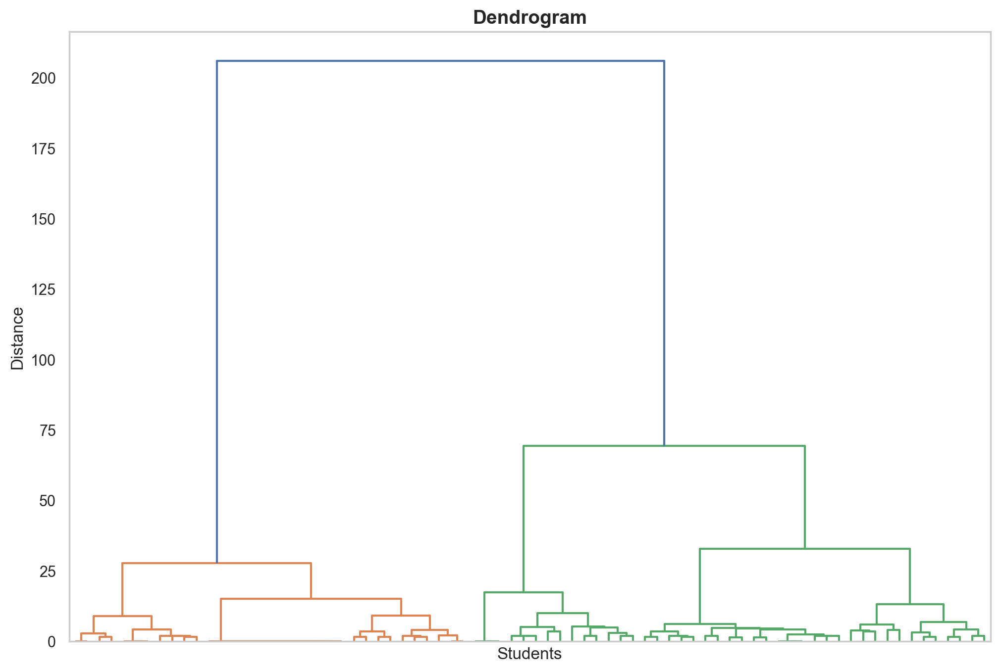
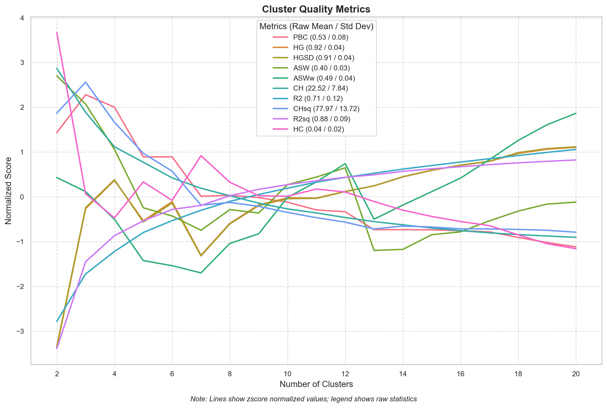
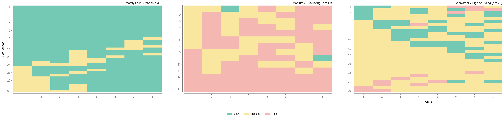
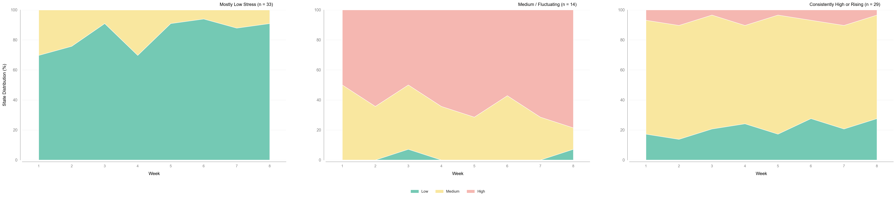

```{r setup, include=FALSE}
knitr::opts_chunk$set(comment = "#>", fig.align = "center")
```

This tutorial shows how to use [`Sequenzo`](https://sequenzo.yuqi-liang.tech/en/) from **R** (via the `{reticulate}` package) to analyze **weekly stress sequences** from the DEPRESS study.

We will use the built-in dataset `students_stress_states_by_week`, which is the same data used in the Python notebook `stress_typical_workflow.ipynb`. The goal is to give a clear, step-by-step introduction that is friendly to R users who are new to Python and to sequence analysis.

- **What you will learn**
  - How to set up `{reticulate}` and load `sequenzo` in R
  - How to load the stress sequence dataset from `sequenzo`
  - How to define a `SequenceData` object for 8-week stress sequences (Low / Medium / High)
  - How to visualize stress trajectories (index plot, state distribution, etc.)
  - How to compute dissimilarities and run a simple cluster analysis (3 stress-pattern clusters)

The tutorial assumes only basic familiarity with R (data frames, packages) and **no prior experience with Python**.

------------------------------------------------------------------------

## Setup

### Install and load R packages

First, make sure you have the necessary R packages. We will use:

- `{pacman}` for easy package loading/installation
- `{reticulate}` to call Python from R
- `{tictoc}` to time longer computations (e.g. distance matrix)
- `{tidyverse}` for basic data wrangling and summaries

```{r packages}
# use (and install if necessary) pacman package
if (!require("pacman")) install.packages("pacman")
library(pacman)

# load and install (if necessary) required packages
pacman::p_load(
  knitr,      # tables
  reticulate, # R interface to Python
  tictoc,     # simple timing
  tidyverse   # data wrangling and plotting
)
```

### One-time Python + Sequenzo installation (if needed)

If you have **never** installed Python or `sequenzo` on this machine, run the following once in your R console (not inside a knitted document), then comment it out:

```{r python-install, eval=FALSE}
# --- First-time setup (run once in your R console, then comment out) ---
# reticulate::install_python()                  # install a Miniconda-based Python
# reticulate::py_install("sequenzo", pip = TRUE) # install the sequenzo package
```

After Python and `sequenzo` are installed, you just need to load them in each new R session.

### Import Python modules

Now we import `sequenzo` from Python. We will also import `matplotlib.pyplot` (as `plt`) in case you want to inspect the figures directly in Python, but this is optional.

```{r import-sequenzo}
library(reticulate)

# Import Python modules
sequenzo <- import("sequenzo")
plt      <- import("matplotlib.pyplot", convert = TRUE)
```

If this chunk runs without error, you are ready to work with `Sequenzo` from R.

------------------------------------------------------------------------

## Get a first look at the data

### Available datasets in Sequenzo

`Sequenzo` comes with several example datasets. We will check that `students_stress_states_by_week` is available.

```{r list-datasets}
available <- sequenzo$list_datasets()
available
```

You should see `students_stress_states_by_week` among the dataset names.

### Load the stress sequence data

Now we load the stress data and convert it from a Python DataFrame to an R data frame.

```{r load-data}
# Load dataset from sequenzo (Python)
df_py <- sequenzo$load_dataset("students_stress_states_by_week")

# Keep as a Python DataFrame and preview in-place
stress <- df_py
stress$head()
```

The dataset has:

- one row per **student**
- columns:
  - `participant_id` (ID)
  - `cohort` (Summer / Fall / Spring)
  - `1`–`8`: weekly stress **states** over 8 weeks
  - background variables such as `gender`, `income_group`, `race`, and `avg_study_time`

### What do L / M / H mean?

In this cleaned dataset, each week is coded as one of three **stress states**:

- **L** = Low stress
- **M** = Medium stress
- **H** = High stress

Each row is therefore a **social sequence** of length 8, e.g.

- `M, M, M, M, M, L, L, M`
- `L, L, L, L, L, L, M, L`
- `H, H, M, M, M, M, M, M`

Our goal is to understand **typical patterns over 8 weeks**, not just individual scores.

------------------------------------------------------------------------

## Define sequence data with Sequenzo

`Sequenzo` works with a central object called `SequenceData`. We will now:

1. Make sure the weekly columns are characters (not factors or logicals).
2. Tell `Sequenzo` which column is the ID.
3. Specify the **time points** (1–8) and the **states** (`L`, `M`, `H`) with labels and colors.

### Prepare the R data frame

```{r prepare-seqdata}
# For this tutorial we work directly with the Python DataFrame.
# It already stores weekly states as strings ('L', 'M', 'H').
stress_seq <- stress
stress_seq$head()
```

### Send the data to Python and create `SequenceData`

```{r define-seqdata}
# Convert to Python DataFrame
stress_py <- r_to_py(stress_seq)

# Define time points and states
time_list <- as.list(as.character(1:8))      # weeks 1–8
states    <- as.list(c("L", "M", "H"))       # Low / Medium / High
labels    <- as.list(c("Low", "Medium", "High"))

# Optional: choose colors for the three states
colors <- as.list(c(
  "#74C9B4",  # Low
  "#F9E79F",  # Medium
  "#F5B7B1"   # High
))

# Initialize the SequenceData object in Python
sequence_data <- sequenzo$SequenceData(
  stress_py,
  time          = time_list,
  id_col        = "participant_id",
  states        = states,
  labels        = labels,
  custom_colors = colors
)

sequence_data
```

You should see a short summary, for example:

> Number of sequences: 76  
> Number of time points: 8  
> States: `['L', 'M', 'H']`

This confirms that `SequenceData` has been created successfully.

------------------------------------------------------------------------

## Visualise stress sequences

Visualization is often the **first and most important step** in sequence analysis. We will create:

- a legend for the stress states
- an index plot (all sequences)
- a state-distribution plot (how common each state is at each week)
- mean time spent in each state

> Tip: In this tutorial we **save** the plots to files (e.g. `index_plot.png`) using the `save_as` argument, and then display them in the document.

### Legend

In each plotting chunk, the first line asks Sequenzo (Python) to **create and save** a PNG file, and `knitr::include_graphics("...")` then **reads that PNG and shows it inside this HTML report**.

```{r plot-legend}
sequence_data$plot_legend(save_as = "stress_legend")
knitr::include_graphics("stress_legend.png")
```

### Index plot — all sequences

Again, the `save_as` argument writes the figure to disk, and `knitr::include_graphics()` pulls that file back into the document so that the plot appears under the code.

```{r index-all}
sequenzo$plot_sequence_index(
  seqdata = sequence_data,
  xlabel  = "Week",
  save_as = "stress_index_all"
)

```

Each horizontal line is a student; colors show Low / Medium / High stress for weeks 1–8.

### State-distribution plot — all sequences

As before, Sequenzo saves the state-distribution figure to `"stress_state_dist_all.png"`, and `knitr::include_graphics()` inserts that saved image into the knitted HTML.

```{r state-dist-all}
sequenzo$plot_state_distribution(
  seqdata = sequence_data,
  xlabel  = "Week",
  save_as = "stress_state_dist_all"
)
knitr::include_graphics("stress_state_dist_all.png")
```

This plot shows, for each week, the **proportion of students** in each stress state. It gives a quick overview: for example, is High stress more common at the beginning or later?

### Mean time in each state

We call `sequenzo$plot_mean_time()` to ask Sequenzo (in Python) to create the figure and **save it as a PNG file**.  
The second line, `knitr::include_graphics("stress_mean_time.png")`, tells Quarto/knitr to **read that PNG file and display it inside the HTML report**.

```{r mean-time}
sequenzo$plot_mean_time(
  seqdata = sequence_data,
  save_as = "stress_mean_time"
)

```

This tells us how many weeks, on average, students spend in each stress level over the 8 weeks.

------------------------------------------------------------------------

## Compute dissimilarities between sequences

To compare sequences and cluster them, we need a **dissimilarity (distance) matrix**.

Here we use **Optimal Matching (OM)** with transition-rate substitution costs (`TRATE`) and automatically chosen insertion/deletion costs (`indel = "auto"`). This is the same configuration used in other Sequenzo tutorials.

```{r om-compute}
#| cache: true
om <- sequenzo$get_distance_matrix(
  seqdata = sequence_data,
  method  = "OM",
  sm      = "TRATE",
  indel   = "auto"
)
```

Inspect the distance matrix in R:

```{r om-inspect}
# `om` is a Python (pandas / NumPy) distance matrix from sequenzo.
# Show a small 5 x 5 block using Python-style indexing for intuition.
om_block <- om$iloc[0:5, 0:5]
om_block
```

Each entry is the dissimilarity between two students’ stress sequences (larger = more different).

------------------------------------------------------------------------

## Cluster analysis

Next, we perform a simple **cluster analysis** on the dissimilarity matrix. We use:

- Ward’s hierarchical clustering
- Cluster quality indices (including Average Silhouette Width, ASW)
- A 3-cluster solution to illustrate distinct stress-pattern groups

### Ward clustering and dendrogram

Here we use the same pattern: Sequenzo computes the dendrogram and saves it as `"stress_dendrogram.png"`, and `knitr::include_graphics()` is responsible for actually displaying that saved image in the report.

```{r cluster}
cluster <- sequenzo$Cluster(
  om,
  sequence_data$ids,
  clustering_method = "ward_d"
)

cluster$plot_dendrogram(
  xlabel  = "Students",
  ylabel  = "Distance",
  save_as = "stress_dendrogram"
)

```
)
```

### Cluster quality and choosing k

`cluster_quality$plot_cqi_scores(..., save_as = "stress_cqi_scores")` creates a PNG of the cluster-quality indices, and `knitr::include_graphics("stress_cqi_scores.png")` embeds that plot in the HTML so readers can see the curve.

```{r cluster-quality}
cluster_quality <- sequenzo$ClusterQuality(cluster)
cluster_quality$compute_cluster_quality_scores()
```

```{r plot-quality}
cluster_quality$plot_cqi_scores(
  norm   = "zscore",
  save_as = "stress_cqi_scores"
)

```

```{r quality-table}
cqi_table <- cluster_quality$get_cqi_table()
cqi_table
```

In this tutorial we focus on a **3-cluster** solution (k = 3), which is often a good starting point for summarizing typical stress patterns (e.g. low, moderate, high / fluctuating trajectories).

```{r set-k}
n_clusters <- 3L
```

### Cluster memberships and distribution

```{r cluster-results}
cr <- sequenzo$ClusterResults(cluster)

# Membership table (Python DataFrame)
membership_py <- cr$get_cluster_memberships(num_clusters = n_clusters)

# Distribution of cluster sizes (printed directly as a pandas DataFrame)
distribution_py <- cr$get_cluster_distribution(num_clusters = n_clusters)
distribution_py
```

```{r plot-distribution}
cr$plot_cluster_distribution(
  num_clusters = n_clusters,
  title        = NULL,
  save_as      = "stress_cluster_dist"
)
knitr::include_graphics("stress_cluster_dist.png")
```

------------------------------------------------------------------------

## Interpreting clusters: index and state-distribution plots

To understand **what the clusters mean**, we look at sequences and state-distribution plots **by cluster**.

### Prepare cluster labels 

We first pass the membership table to the Python namespace and create some human-readable labels. Here is an example with three descriptive labels that you can adapt to your own data:

```{r cluster-labels}
# make membership table available as 'membership_table' in Python
py$membership_table <- membership_py

py_run_string("
membership_table['Cluster'] = membership_table['Cluster'].astype(int)

cluster_labels = {
    1: 'Mostly Low Stress',
    2: 'Medium / Fluctuating',
    3: 'Consistently High or Rising'
}
")

cluster_labels_py <- py$cluster_labels

# R named vector (useful if you later merge back into an R data frame)
cluster_labels_r <- c(
  `1` = "Mostly Low Stress",
  `2` = "Medium / Fluctuating",
  `3` = "Consistently High or Rising"
)
```

### Index plots by cluster

In the next two chunks, the Python calls write cluster-specific plots to PNG files, and each `knitr::include_graphics("...")` line is what actually pulls those PNGs into the document so you can see the plots.

```{r index-clusters}
py_run_string("
from sequenzo import plot_sequence_index

plot_sequence_index(
    seqdata         = r.sequence_data,
    group_dataframe = membership_table,
    group_column_name = 'Cluster',
    group_labels    = cluster_labels,
    xlabel          = 'Week',
    save_as         = 'stress_index_clusters'
)
")

```

Look at how typical stress trajectories differ across clusters. For example, one cluster may show mostly Low stress, while another shows frequent High stress or increasing stress over time.

### State-distribution plots by cluster

```{r state-dist-clusters}
py_run_string("
from sequenzo import plot_state_distribution

plot_state_distribution(
    seqdata         = r.sequence_data,
    group_dataframe = membership_table,
    group_column_name = 'Cluster',
    group_labels    = cluster_labels,
    xlabel          = 'Week',
    save_as         = 'stress_state_dist_clusters'
)
")

```

These plots show, for each cluster and for each week, the proportion of students in Low / Medium / High stress. This makes it easier to describe each cluster in words (for example, “mostly Low stress throughout” vs. “starts Medium and becomes High”).

------------------------------------------------------------------------

## Prepare for further analysis in R

Often you will want to relate stress-pattern clusters to background variables (e.g. `cohort`, `gender`, `income_group`, `avg_study_time`) using regression models in **R**.

Here we merge the cluster assignments back into the original R data frame:

```{r merge-clusters}
# For simplicity (and to avoid R/Python conversion issues), we inspect
# the first rows of the Python membership table directly.
membership_py$head()
```

You can now:

- run regression models in R (e.g. multinomial logit) with cluster membership as the outcome
- explore cross-tabulations of cluster by `cohort`, `gender`, etc.
- create your own visualizations with `{ggplot2}`

Optionally, you can also export a small file with IDs and cluster labels:

```{r export, eval=FALSE}
write.csv(
  stress_with_clusters |>
    select(participant_id, cohort, gender, income_group, Cluster, Cluster_labels),
  "stress_cluster_memberships.csv",
  row.names = FALSE
)
```

------------------------------------------------------------------------

## Summary

In this tutorial, you have:

1. Set up `{reticulate}` and called Python’s `sequenzo` package from R.
2. Loaded the **students_stress_states_by_week** dataset from DEPRESS and created a `SequenceData` object for 8-week stress sequences.
3. Visualized stress trajectories using index plots and state-distribution plots.
4. Computed sequence dissimilarities with Optimal Matching and ran a simple cluster analysis.
5. Interpreted clusters as typical stress trajectories and merged them back into an R data frame for further analysis.

The same workflow can be adapted to your own sequence data: you just need an ID column, a set of time-ordered state columns, and (optionally) background variables for later modeling.

